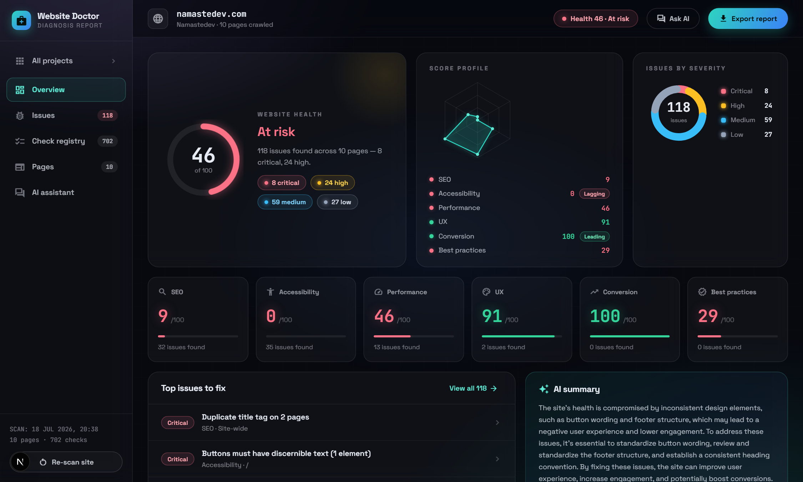
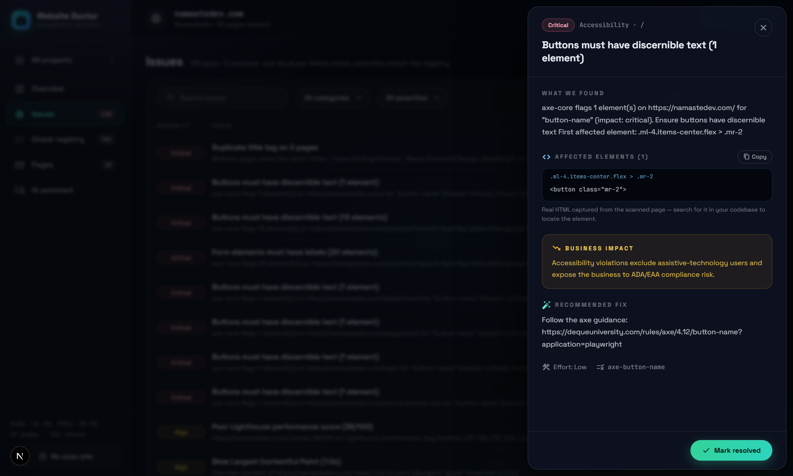
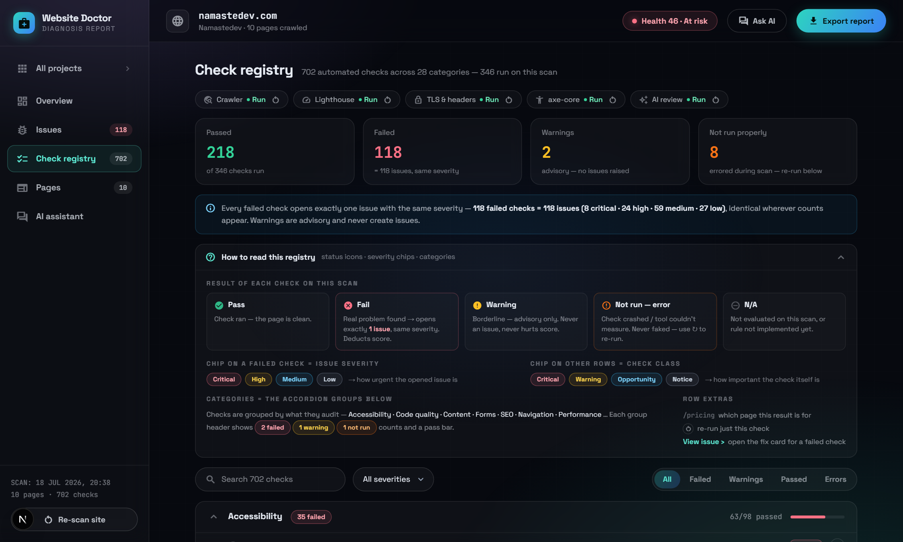
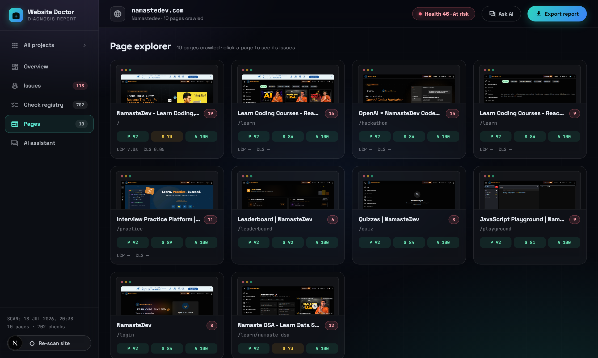

# 🩺 Website Doctor

**Your website, diagnosed in minutes.** Paste a URL — get a full health report:
real crawling, 60+ real automated checks, Lighthouse + axe-core audits, security
probes, and an AI layer that reviews every screenshot like a senior designer and
writes copy-paste fixes for every problem it finds.

Built for the **OpenAI Codex Hackathon 2026** (NamasteDev) — AI-built, AI-powered,
and honest to the core: this scanner never fakes a result.



## What it does

One scan runs a real 15-stage pipeline against the live site:

```
crawl (≤10 pages, headless Chromium) → screenshots → HTML extraction (Cheerio)
→ Lighthouse per page → axe-core per page → security headers + TLS probe
→ broken-link probes → 60+ rule checks → AI vision review (real screenshots)
→ AI HTML review → AI cross-page consistency → AI fix generator → scores
```

Everything you see is measured, never mocked:

- **Health score + 6 category scores** (SEO, Accessibility, Performance, UX,
  Conversion, Best practices) — severity-weighted, config-driven, repeat-damped.
- **Issues with real evidence** — every issue shows what was found, the business
  impact, a recommended fix with ready-to-paste code, and the **actual offending
  HTML elements** captured from the page (selector + snippet).
- **AI that earns its place** — vision review of real screenshots, markup review
  of real extracted data, cross-page consistency analysis, an executive summary,
  and a site-aware chat that answers **only** from the stored analysis (and
  refuses everything else).
- **Live scan progress** — 15-stage timeline over Server-Sent Events with a
  terminal-style telemetry log of what the scanner is actually doing.
- **PDF export** — Playwright print-to-PDF of the full report.



## The honesty invariant

Most site checkers hand-wave. Website Doctor enforces two hard rules:

1. **Every failed check opens exactly one issue with the same severity** —
   enforced by a database unique index. Counts reconcile everywhere: registry
   failed total = issues total, identical severity breakdowns in every view.
2. **A check that didn't run says so.** Crashed rule? Rate-limited AI call?
   Lighthouse couldn't load the page? The registry shows an orange
   **"Not run — error"** row with the real reason — never a fake pass, never a
   fake 0/100. Every implemented check has a one-click **re-run** button
   (offline from stored artifacts where possible).



## Quickstart

```bash
pnpm install
cp .env.example .env       # add a free Groq key (console.groq.com) — or Gemini
pnpm dev                   # → http://localhost:3000
```

Paste any URL on the home page. A 10-page scan with AI takes ~3-5 minutes; the
Analyzing view streams live progress. Quality gate:

```bash
bash scripts/validate.sh   # typecheck + lint + build + 28 unit tests + LIVE smoke scan
```

The smoke test is the real-integration proof: it boots the app, scans a live
public URL end-to-end, and asserts persisted findings + the 1:1 invariant.

## Deploying (public URL)

Playwright + Lighthouse need a real server (not serverless). One-click-ish via
the included `Dockerfile` + `render.yaml` — see **[DEPLOY.md](DEPLOY.md)**.

## AI: provider-agnostic, free-tier friendly

All AI flows behind one `AIProvider` interface with zod-validated JSON output:

| Provider | Config | Notes |
|---|---|---|
| **Groq** (default) | `AI_PROVIDER=groq` + free key | Llama 3.3 70B text, Qwen 3.6 vision |
| Gemini | `AI_PROVIDER=gemini` | JSON response-schema mode |
| OpenRouter / Mistral / xAI | by name | any OpenAI-compatible endpoint |

Rate-limit aware (respects `retry-after`, spaces calls), degrades gracefully —
if the AI is down, the scan still completes and the report says exactly which
reviews didn't run. Prompts live as files in `lib/ai/prompts/`, never hardcoded.

## Demo limits (and how to unlock full power)

The hosted demo runs entirely on **free tiers** (server + Groq AI). To stay
inside their rate limits, the demo scan is deliberately capped: AI vision
review on 2 pages, Lighthouse on 5, and a 3-second gap between AI calls.
**These are configuration values, not engineering limits.** Run locally and
the same pipeline audits every crawled page at full depth:

```env
# .env — full-potential local run
LIGHTHOUSE_MAX_PAGES=10
AI_MAX_VISION_PAGES=10
AI_MAX_HTML_PAGES=10
AI_MAX_FIX_ISSUES=50
AI_CALL_GAP_MS=0
```

And in keeping with the honesty invariant: anything a rate limit prevents from
running is **never faked** — it shows a "Not run — error" row with the real
reason and a one-click re-run button. A QC tool that fakes its own results
can't be trusted to QC anything.

## Architecture

```
app/                    Next.js App Router — UI views + API route handlers
lib/services/           crawler, fetcher, extractor, pipeline, jobs, scoring,
                        issues (1:1 builder), report, rerun
lib/rules/defs/         one file per rule — glob-discovered at build time,
                        adding a rule requires ZERO orchestration changes
lib/analyzers/          Lighthouse, axe-core, security/TLS, link probes
lib/ai/                 provider interface, Gemini + OpenAI-compat impls,
                        prompt files, review stages, fix generator
config/scoring-weights.ts   THE scoring config — all weights in one file
data/                   SQLite (Drizzle ORM) + crawl artifacts per job
```

- **TypeScript strict, no `any`** · pino structured logging · per-analyzer error
  isolation · 28 unit tests wired into the validate gate.
- 393 checks registered (62 fully implemented and running; the full 331-check
  industry catalog is registered honestly as N/A until implemented — never
  displayed as passing).



## How AI built this

The entire product was pair-built with an AI coding agent (Claude Code) against
a written spec and design contract, working phase-by-phase with a hard quality
gate: every change had to keep `validate.sh` green — typecheck, lint, build,
unit tests, and a **live end-to-end smoke scan** — before it could be committed.
The product itself then uses AI as a core feature, not a wrapper: vision review,
markup review, cross-page analysis, fix generation, and grounded chat.

## License

MIT
